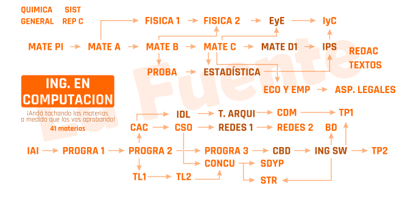

# 🎓 Computer Engineering Notes (UNLP)

Notes, summaries, exams, lab assignments, and source code from my **Computer Engineering** degree at **Universidad Nacional de La Plata (UNLP)**, covering courses from both the **Faculty of Engineering** and the **Faculty of Informatics**.

> 📌 **Note:** Most course material is in Spanish and several engineering subjects had handwritten resolutions that are not included in this repository.

---

## 🎯 Career Path

Official curriculum: [UNLP Study Plan (2011)](https://ic.info.unlp.edu.ar/plan-de-estudio-2011/).

---

## 📂 Repository Structure

- ⚙️ **[Engineering/](Engineering/)**: Math, Physics, Chemistry, Electronics, Signals, and Control.
- 💻 **[Informatics/](Informatics/)**: Programming, Algorithms, Computer Architecture, OS, Databases, Networks, Concurrency, and Distributed Systems.
- 📁 **[Extra/](Extra/)**: English requirement, PPS (Professional Practices), and elective subjects.

---

## 🗺️ Subject Paths

### ⚙️ Engineering (`Engineering/`)

- **Admission**
  - [Math Admission](Engineering/Admission)
- **1st Semester**
  - [Chemistry](Engineering/1-First%20Semester/Chemestry)
  - [Math (A)](Engineering/1-First%20Semester/Math%20%28A%29)
- **2nd Semester**
  - [Drawing (AutoCAD)](Engineering/2-Second%20Semester/Drawing%20%28Autocad%29)
  - [Math (B)](Engineering/2-Second%20Semester/Math%20%28B%29)
- **3rd Semester**
  - [Physics I](Engineering/3-Third%20Semester/Physics%20I)
- **4th Semester**
  - [Math (C)](Engineering/4-Fourth%20Semester/Math%20%28C%29)
  - [Physics II](Engineering/4-Fourth%20Semester/Physics%20II)
  - [Probability](Engineering/4-Fourth%20Semester/Probability)
- **5th Semester**
  - [Electronics and More](Engineering/5-Fifth%20Semester/Electronics%20and%20More)
  - [Introduction to Logic Design](Engineering/5-Fifth%20Semester/Introduction%20to%20Logic%20Design)
  - [Math (D1)](Engineering/5-Fifth%20Semester/Math%20%28D1%29)
  - [Statistics](Engineering/5-Fifth%20Semester/Stadistics)
- **6th Semester**
  - [Data Networks I](Engineering/6-Sixth%20Semester/Data%20Networks%20I)
  - [Introduction to Signal Processing](Engineering/6-Sixth%20Semester/Introduction%20to%20Signal%20Prosesing)
- **7th Semester**
  - [Digital Circuits and Microcontrollers](Engineering/7-Seventh%20Semester/Digital%20circuits%20and%20microcontrollers)
  - [Economy](Engineering/7-Seventh%20Semester/Economy)
  - [Instrumentation and Control](Engineering/7-Seventh%20Semester/Instrumentation%20and%20control)
- **8th Semester**
  - [Professional Texts Seminar](Engineering/8-Eighth%20Semester/Professional%20Texts%20Seminar)
  - [Project Workshop I](Engineering/8-Eighth%20Semester/Project%20Workshop%20%20I)
- **9th Semester**
  - [Electronics II *(Elective)*](Engineering/9-Ninth%20Semester/Electronics%20II)
  - [Introduction to Quantum Computer Architecture *(Elective)*](Engineering/9-Ninth%20Semester/Introduction%20to%20Quantum%20Computer%20Architecture)

---

### 💻 Informatics (`Informatics/`)

- **Admission**
  - [Introduction to Informatics (IAI)](Informatics/Admission)
- **1st Semester**
  - [Introduction to Programming I (EPA)](Informatics/1-First%20Semester/Introduction%20to%20Programming%20I)
- **2nd Semester**
  - [Introduction to Programming II (CADP / Workshop)](Informatics/2-Second%20Semester/Introduction%20to%20Programming%20II)
- **3rd Semester**
  - [Computer Architecture Introduction](Informatics/3-Third%20Semester/Computer%20Architecture%20Introduction)
  - [Introduction to Programming III (FOD / Algorithms)](Informatics/3-Third%20Semester/Introduction%20to%20Programming%20III)
  - [Languages Workshop I (C)](Informatics/3-Third%20Semester/Languages%20Workshop%20I%20%28C%29)
- **4th Semester**
  - [Languages Workshop II (Java)](Informatics/4-Fourth%20Semester/Languages%20Workshop%20II)
  - [Operating Systems](Informatics/4-Fourth%20Semester/Operative%20Systems)
- **5th Semester**
  - [Introduction to Databases](Informatics/5-Fifth%20Semester/Introduction%20to%20Data%20Bases)
- **6th Semester**
  - [Deep Learning *(Elective)*](Informatics/6-Sixth%20Semester/Deep%20Learning)
  - [Hardware Architecture Design (VHDL)](Informatics/6-Sixth%20Semester/Hardware%20Architecture%20Design)
  - [Software Engineering](Informatics/6-Sixth%20Semester/Software%20Engineering)
- **7th Semester**
  - [Concurrency and Parallelism](Informatics/7-Seventh%20Semester/Concurrency%20%20and%20Parallelism)
  - [Databases](Informatics/7-Seventh%20Semester/Data%20Bases)
- **8th Semester**
  - [Data Networks II](Informatics/8-Eighth%20Semester/Data%20Networks%20II)
  - [Introduction to Quantum Programming *(Elective)*](Informatics/8-Eighth%20Semester/Introduction%20to%20Quantum%20Programming)
  - [Project Workshop II](Informatics/8-Eighth%20Semester/Project%20Workshop%20%20II)
  - [Real-Time Systems](Informatics/8-Eighth%20Semester/Real-Time%20Systems)
- **9th Semester**
  - [Distributed and Parallel Systems](Informatics/9-Ninth%20Semester/Distributed%20and%20Parallel%20Systems)
  - [Legal and Professional Aspects](Informatics/9-Ninth%20Semester/Legal%20and%20Professional%20Aspects)

---

### 📂 Extra (`Extra/`)

- 🇬🇧 **[English](Extra/English/)**: Grammar summaries, coursework guides, and exams.
- 💼 **[PPS (Professional Practices)](Extra/PPS-Professional%20practices/)**: Final degree internship project on Qiskit code migration with LLMs, RAG chatbot, n8n workflows, and final PDF thesis.
- 📑 **[Elective Subjects](Extra/Elective%20Subjects.md)**: Quick summary of all elective subjects.

---

## 🛠️ Languages & Tools

- **Languages:** C, C++, Python, Java, Assembly (x86 / MCX8088), Pascal, VHDL, SQL, CUDA, MATLAB, NetLogo, Bash.
- **Tools & Frameworks:** TensorFlow, Keras, Scikit-learn, Qiskit, n8n, Docker, Git, Jupyter, Eclipse, BlueJ, AutoCAD, Active-HDL, Arduino, LaTeX.
- *and more...* 😊

---

## 📜 License

Academic coursework repository. For institutional inquiries, contact [UNLP](https://unlp.edu.ar/).
